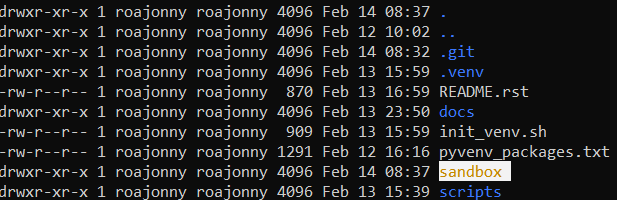

Getting Started
===============

Activating the virtual environment
----------------------------------

Confirm the `Python Virtual Environment <https://realpython.com/python-virtual-environments-a-primer/#what-is-a-python-virtual-environment>`_
is active - you should see ``(.venv)`` next to your username on the command line:

|

   *Virtual environment is active*

|

If you don't see it, navigate to where you cloned the repository and source the
``init_venv.sh`` bash script:

|

   *Location of environment initialization script*

|

.. note::

   The script takes care of the virtual environment setup, and installs package
   dependencies for all the tools mentioned throughout this example
   documentation, so you can just focus on tutorials and effectively skip any
   steps that ask you to run any ``pip install`` commands

|

Creating your sandbox
---------------------

Next, you'll want to create your own working directory, or a "sandbox", for
going through the tutorials in the next section. 

In the repo, let's run ``mkdir sandbox`` and you should see that it was
created:

|

   *Creating the tutorial sandbox*

|

Let's ``cd sandbox`` and starting building our foundations.
